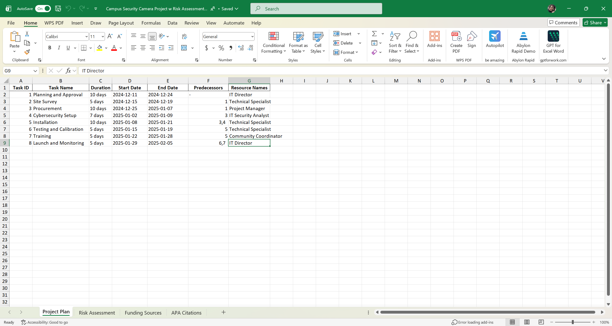
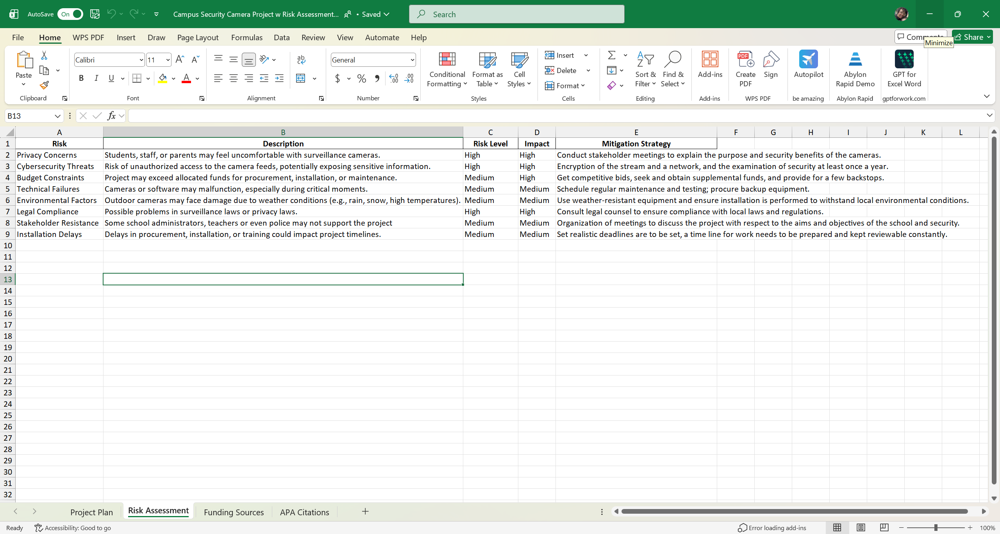
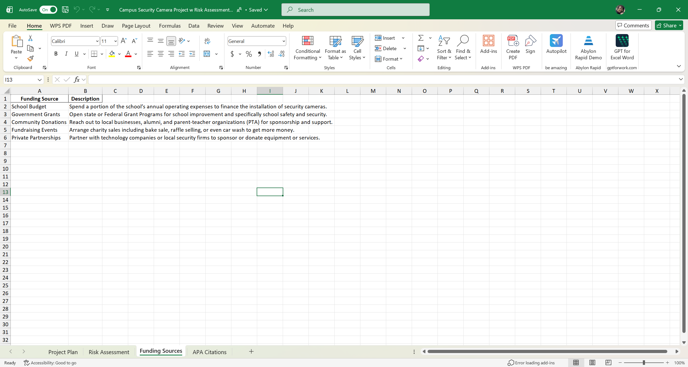
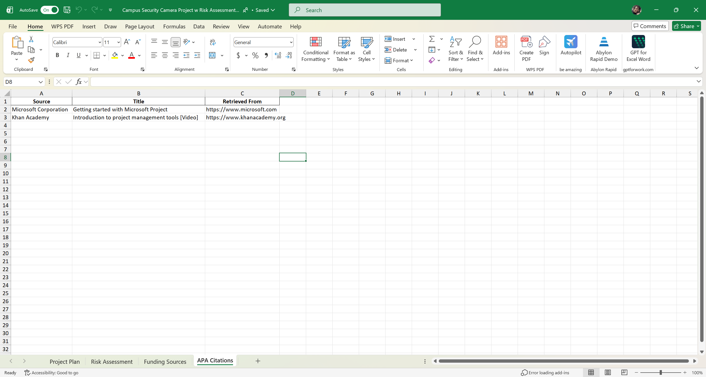

# Campus Security Risk Assessment & Surveillance System

## Overview

This project presents a campus-wide security and surveillance assessment designed to identify risks, evaluate vulnerabilities, and improve overall security posture. It combines cybersecurity principles with physical security planning to address real-world threats in a campus environment.

## Objective

To analyze potential security risks in surveillance systems and implement mitigation strategies that improve safety, protect sensitive data, and ensure system reliability.

## Technologies & Tools Used

* Microsoft Excel (Risk Assessment Matrix)
* Risk Analysis Methodologies
* Access Control Concepts
* Security Best Practices (NIST-aligned)

## Key Features

* Developed a structured risk matrix evaluating likelihood and impact of threats
* Identified vulnerabilities such as unauthorized access, system failures, and data exposure
* Designed mitigation strategies including encryption, access controls, and redundancy
* Provided recommendations to improve system security and operational resilience

## Screenshots

### Risk Matrix Overview

### Risk Analysis & Mitigation Details

### Project Implementation Timeline

### Funding Strategy Overview

This project includes a structured risk matrix, mitigation planning, implementation timeline, and funding strategy to support a real-world campus security system.

## Security Considerations

* Protection of surveillance data through encryption and secure storage
* Role-based access control to restrict unauthorized system access
* Monitoring and auditing practices for accountability
* Alignment with cybersecurity and privacy best practices

## Project Files

* Campus_Security_Risk_Assessment.xlsx

## Outcome

This project demonstrates the ability to perform risk assessments, identify vulnerabilities, and design security-focused solutions. It highlights skills in cybersecurity analysis, IT governance, and infrastructure planning.

## Relevance

This project is relevant to roles in:

* IT Support
* Cybersecurity
* Systems Administration
* Risk & Compliance

---

Created by Britany Walker
IT Support | Systems Administration | Cybersecurity
